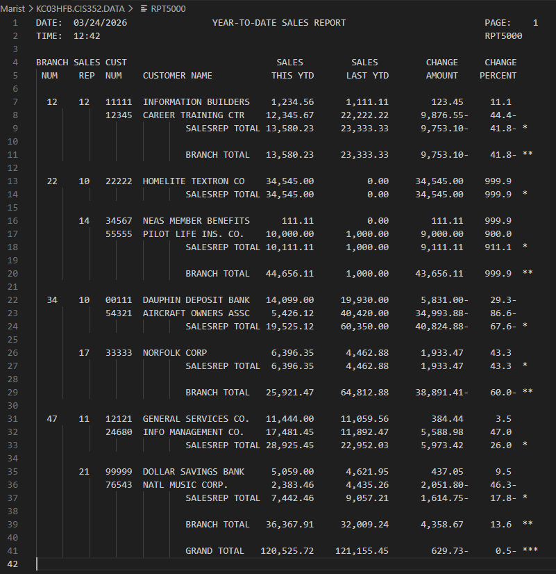

# RPT5000

## Author
* [Violet French](https://github.com/Pirategirl9000)

## Table of Contents
* [Author](#author)
* [Purpose](#purpose)
* [New Concepts](#new-concepts-used)
* [Script Breakdown](#script-breakdown)
* [Credits](#credits)

## Purpose
This program uses a dataset to produce a report based on customer sales reports. The resulting report will be stored to a new dataset. The report details the spendings for this year and last as well as the difference between the two for each customer. Also produces subtotals for both the branch and salesrep as well as grand-totals for the report

## New Concepts Used
* Calculating a new subtotal
* Evaluate statements
* Logical Negation
* 88 level data numbers

## Script Breakdown

### File Definitions
* `CUSTMAST` - The name of the input file
  * `CUSTOMER-MASTER-RECORD` - A record containing all the information about each customer
* `ORPT5000` - The COBOL alias for the output file which is RPT5000
  * `PRINT-AREA` - 130 size picture clause for writing to the file

### Notable Data Items & Records
* `CUSTMAST-EOF-SWITCH` - Marks when the end of the file has been reached
* `PRINT-FIELDS` - Record containing information about the page including lines per page, current line, and page number
* `TOTAL-FIELDS` - Record containing information about the grand totals for last YTD and this YTD
* `CURRENT-DATE-AND-TIME` - Record used for grabbing the current data and time via the CURRENT-DATE-AND-TIME function
* `CHANGE-AMOUNT` - Contains the difference in sales between last YTD and this YTD
* `HEADING-LINE-1` THRU `HEADING-LINE-6` - Records 130 character long used for outputting header lines for each page
* `CUSTOMER-LINE` - Record containing information about the current customer
  * `CL-BRANCH-NUMBER` - The branch number for this customer, only printed once for each branch
  * `CL-CUSTOMER-NAME` - The name of this customer
  * `CL-SALES-THIS-YTD` - Sales this year-to-date
  * `CL-SALES-LAST-YTD` - Sales last year-to-date
  * `CL-CHANGE-AMOUNT` - The difference between this year and last year's sales
  * `CL-CHANGE-PERCENT` - The percent difference between this year and last year's sales
* `GRAND-TOTAL-LINE-` AND `BRANCH-TOTAL-LINE` - Record used for outputting the grandtotal and subtotal
  * `SALES-THIS-YTD` - Total sales for this year-to-date
  * `SALES-LAST-YTD` - Total sales last year-to-date
  * `CHANGE-AMOUNT` - The total difference between last year's sales and this years
  * `CHANGE-PERCENT` - The percentage difference between last year's sales and this years
 
### Notable Paragraphs
* `000-PREPARE-SALES-REPORT`
  * Opens and closes the IO files and delgates the work for reading/writing them
  * If branch number of current customer is greater than the branch number of the last customer calls for the printing of
  a branch line 
* `100-FORMAT-REPORT-HEADING`
  * Formats the header file by retrieving the date and moving it to the appropriate header lines
* `200-PREPARE-SALES-LINES`
  * Calls `210-READ-CUSTOMER-RECORD` to read the current record then if it's not the last record it calls `220-PRINT-CUSTOMER-LINE` to print the customer line
* `210-READ-CUSTOMER-RECORD`
  * Reads the next line of the customer records and if it's the end of file it moves 'Y' to `CUSTMAST-EOF-SWITCH`
* `220-PRINT-CUSTOMER-LINE`
  * If this line is on the next page, reprints the header lines, then performs calculations for determining the values for the customer line before outputting them with the other customer information gathered from the input file
* `230-PRINT-HEADING-LINES`
  * Moves to the next page by resetting line count, incrementing page count, and reprinting header lines
* `240-PRINT-BRANCH-LINE`
  * Prints the current subtotals for this branch and adds them to the grand totals  
* `300-PRINT-GRAND-TOTALS`
  * Calculates and prints the grand totals
 
## Credits
###### This program is an adaptation of a script provided by [Murach's Mainframe COBOL](https://www.murach.com/shop/murachs-mainframe-cobol-detail) and edited by [Debbie Johnson](https://github.com/dejohns2)
